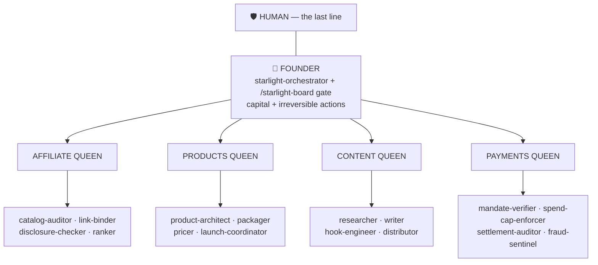
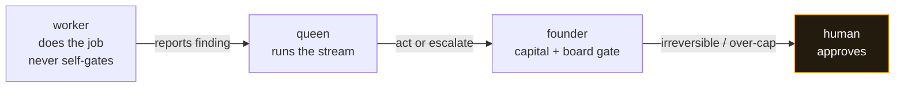

<!-- GITHUB_VISUALS_START -->
<p align="center">
  
</p>

<details open>
<summary><strong>How this repo works</strong></summary>
<p align="center">
  
</p>
</details>

<!-- GITHUB_VISUALS_END -->

<div align="center">

# 🐝 Starlight Swarm

### Queen-led, fail-closed orchestration for AI income streams

> **L6 — Swarm Runtime** of the agentic-income ecosystem. Queens run the streams,
> workers do the work, the founder owns capital and the irreversible gate, and a
> human holds the last line. The orchestration *contract*, in typed TypeScript —
> never wired to live funds.


[](https://github.com/frankxai/Starlight-Intelligence-System)
[](https://opensource.org/licenses/MIT)

[**⚡ Run the dry-run**](#run-the-dry-run) · [**🧬 The model**](#the-model) · [**🪜 Escalation spine**](#escalation-spine) · [**🗺️ Where it sits**](#where-it-sits)

</div>

---

> [!WARNING]
> **No live action fires. No real money moves.** This repo models the orchestration
> *contract* — config, a `Queen` class, a pure escalation classifier, and the MCP
> integration layer. It must never be wired to live funds. Agents draft, verify, and
> gate. Humans deploy, post, send, and approve capital.

---

## ⚠️ Status

**v0.2 — unit-tested safety spine + real payments-MCP adapter (still dry-run only).**

What v0.2 hardens over the v0.1 scaffold (the model is unchanged; the *confidence* is higher):

- **The escalation spine is unit-tested.** `classify()` + `overCap()` — the load-bearing
  safety code — have full-branch coverage, including the fail-closed invariants: a
  `null`/`undefined` action → `human-gate`, and a missing / `NaN` amount or cap → treated
  as over-cap (never silently passes).
- **The Payments Queen speaks to a real payments-MCP adapter.** Its verify step calls an
  actual MCP client (`paymentsMcpFromClient`) bridging to the `@frankx-ai/payments-mcp`
  server over stdio (`connectRealPayments`). It is **verify-only** (`verify_mandate` /
  `check_spend_cap` / `record_audit_entry` / `require_human_approval` — there is no transfer
  tool, by design) and **fail-closed**: any transport error, MCP error, or garbled result
  resolves to the SAFE verdict (invalid / over-cap / not-recorded / pending), never a pass.
  If the server isn't built or reachable, the adapter degrades cleanly to the fail-closed dry-run.

This hardens the model; it does **not** make the swarm autonomously act.

---

<a id="the-model"></a>

## 🧬 The model: hybrid queens-per-stream

Topology: **queen-led per stream, mesh within a stream.** Queens never command across
streams — they coordinate through the founder.



---

<a id="escalation-spine"></a>

## 🪜 The escalation spine

`classify(action)` routes every action to exactly one tier. No autonomous money movement, ever.



Payments go through the Payments MCP (AP2 mandate verify + spend-cap, verify-only,
fail-closed). See [`docs/SWARM-ARCHITECTURE.md`](docs/SWARM-ARCHITECTURE.md).

---

## 📂 Layout

```
src/swarm/
  streams.ts       4 income streams + queens + workers as typed config
  queen.ts         Queen class — owns workers, runs a loop step, act-vs-escalate
  worker.ts        Worker interface — one job, append-only memory, never self-gates
  escalation.ts    classify(action) → autonomous | queen-gate | founder-board | human-gate
  integrations.ts  MCP integration: SIS sis_* stubs + REAL payments-MCP adapter (verify-only, fail-closed)
  index.ts         the dry-run: prints the tree + escalation path + a real payments-MCP round-trip
  escalation.test.ts    full-branch tests for the safety spine (incl. fail-closed)
  queen.test.ts         worker-guard + act-vs-escalate routing tests
  integrations.test.ts  payments-MCP adapter wire shape + fail-closed + queen↔adapter tests
src/pages/
  swarm.tsx        cockpit page rendering the stream → queen → worker tree + legend
docs/SWARM-ARCHITECTURE.md   the architecture narrative
local-cockpit.html           static operator console (now includes the swarm tree)
```

---

<a id="run-the-dry-run"></a>

## ⚡ Run the dry-run

```bash
npm install
npm run swarm:dry-run    # founder→queen→worker tree + escalation ladder + per-queen loop step + real payments-MCP round-trip
npm run typecheck        # tsc --noEmit
npm test                 # tsc --noEmit && node --test --import tsx src/swarm/*.test.ts
npm run build            # next build (cockpit)
npm run dev              # next dev -p 3007  →  http://localhost:3007/swarm
```

The dry-run walks every escalation tier through `classify()`, runs one self-improving-loop
step per queen (including an over-cap payment that escalates worker → queen → founder →
human), and connects the **real** payments-MCP adapter for one verify-only round-trip.
Nothing fires; no money moves.

To exercise the real adapter against your own checkout, point it at the built server
(defaults to `../payment-intelligence-system/mcp/dist/index.js`):

```bash
PAYMENTS_MCP_PATH=/abs/path/to/payments-mcp/dist/index.js npm run swarm:dry-run
```

If the server isn't built, the adapter degrades to the fail-closed dry-run.

---

<a id="where-it-sits"></a>

## 🗺️ Where this sits in the stack

```
L7 ASSURANCE        starlight-evals — wraps everything
L6 SWARM RUNTIME    ◀ this repo
L5 PAYMENTS         payment-intelligence-system
L4 INCOME ENGINE
L3 OS FAMILY
L2 CONFIG           agentic-ops-hub
L1 CAPABILITY
L0 SUBSTRATE        Starlight-Intelligence-System
```

> Layer model + contract: [`agentic-ops-hub/ECOSYSTEM.md`](https://github.com/frankxai/agentic-ops-hub/blob/main/ECOSYSTEM.md)
> · Agent stack + escalation contract: [`agentic-ops-hub/docs/AGENT-STACK.md`](https://github.com/frankxai/agentic-ops-hub/blob/main/docs/AGENT-STACK.md)
> · Protection layers: [`agentic-ops-hub/PROTECTION-LAYERS.md`](https://github.com/frankxai/agentic-ops-hub/blob/main/PROTECTION-LAYERS.md)

---

<div align="center">

**Built on SIP** · Starlight Intelligence Protocol · MIT · _No autonomous money movement, ever._

</div>
