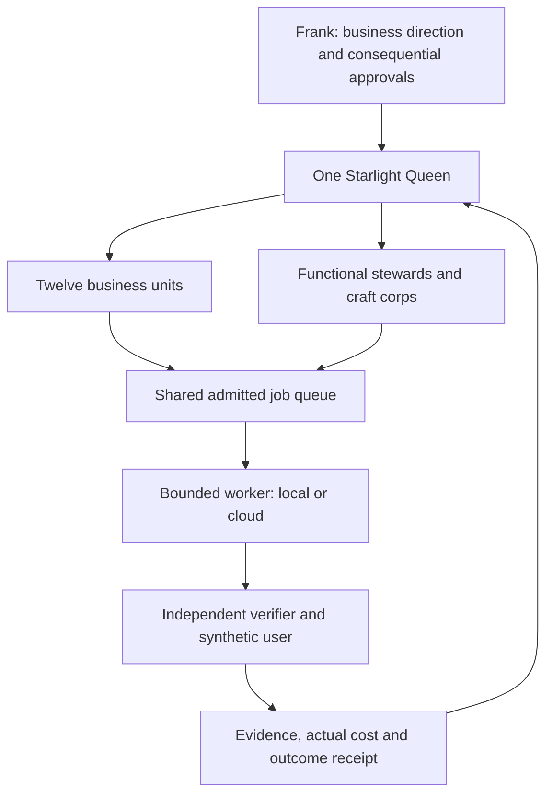

# Autonomous workforce: current evidence and implementation

Status: first implementation tested locally; no worker activation or infrastructure mutation.
Validation: TypeScript passed with a 256 MB heap limit; 159 existing tests and 11 new tests passed;
the runtime dry-run completed with its expected fail-closed fallback for the unbuilt payments server;
`git diff --check` passed. The existing tests ran sequentially. No web build was required.

## Architecture decision

Adopt the September 2 ruling: one Starlight Queen owns admission, routing and recording.
Twelve business units share twelve functional stewards, three craft corps and five advisory
executives. The two sets of twelve describe different things. A business unit can use several
stewards; the primary stewardship mapping in `runtime/policies/estate-workforce.json` is a
proposed routing projection, not a replacement for Agent Cards or the stewardship charter.

Register all units immediately; the first operational cells are FrankX, Starlight and GenCreator.
Each cell uses a coordinator, maker, independent verifier and a synthetic user in an isolated test
environment. Roles are reusable identities; worker instances are created for admitted jobs.
Synthetic users never receive production credentials and their results never substitute for real
customer demand. New vertical and horizontal ideas enter the master's venture backlog and get an
owning unit before work starts. They do not create extra standing Queens or schedules.

## What the September 5 inspection established

The local systems graph was generated at `2026-09-04T23:03:40.484Z`. It reports 61 Hermes jobs
(31 enabled, plane stalled), 34 loop contracts (plane stalled), and 27 n8n workflows flagged active
without execution heartbeats. These are snapshot findings, not fresh probes of each task.
The read-only workforce check deliberately labels the snapshot stale at evaluation time.

Live Railway connector inspection in this session found seven projects. In their production
environments, latest deployment status was:

| Surface | Observed status | Meaning |
| --- | --- | --- |
| n8n Primary, Worker and hermes-worker | Success | Deployments succeeded; estate job completion remains unproven |
| Original temporal_server in loyal-possibility | Success | Reuse candidate; workflow canary still required |
| Langfuse web and worker in perceptive-curiosity | Success | Trace ingest/read-back canary still required |
| Extra temporal and postiz in n8n project | Failed | Do not treat these as the canonical working services |
| Postiz in loyal-possibility | Success | Separate from the content policy's C940 target; reconcile ownership before publishing |
| evals-service in perceptive-curiosity | Failed | Existing evals-runner separately reports deployment success |

The `hermes-worker` service runs image `nousresearch/hermes-agent:v2026.8.27` with start command
`/opt/hermes/docker/entrypoint-dispatch.sh gateway run`. Its directly configured variable names
are dashboard configuration and authentication only. No model credential or queue credential was
proven by that response; inherited secrets were not inspected. The observed config listed no volume
mount. This is insufficient evidence of a durable estate queue drainer.

The existing bridge remains laptop-bound according to the systems graph. Its implementation exists
in the legacy runtime checkout and on `agentic-ops` branch `agent/claude/bridge-hardening`, while the
canonical agentic-ops checkout contains other dirty work. Reconciliation must precede deployment.
Adding HTTP to a laptop-hosted queue alone will not provide laptop-off availability: durable queue
storage and the admission service must also run in an available failure domain.

Machine preflight returned hold: about 4.5 GB RAM free and 71.1 GiB disk free (7.5%). Only text edits
and small tests were used. No worktree, install, build, background worker or second-provider process
was started. Existing checkouts and services were preserved.

## Implemented interface

`npm run workforce:check -- <systems.graph.json> [--markdown]` reads the existing estate graph and
the twelve-unit projection. JSON output uses `starlight.workforce-readiness/v1`; Markdown provides
a compact business-unit/steward table and owner-addressed blockers. It writes only to stdout.
Exit 0 means no blockers, 2 means a blocked assessment, and 1 means invalid arguments or unreadable
input. The current implementation always includes the trusted-admission and cloud-canary blockers,
so it cannot produce a launch authorization. `admitted` is always false. Unknown worker counts are
null, not zero or guessed from rendered agent files.

Fresh graph generation cannot launder an old provider snapshot. Source timestamps are checked
individually with a 15-minute freshness bound and a one-minute future-clock allowance. Date-only
cloud captures are unknown. Steward evidence requires a recent observation plus heartbeat;
it is not a claim that a worker is active. This projection does not replace `runtime:assess`,
its pack provenance checks or the pending trusted admission authority.

Run `npm run workforce:test` for dependency-free regression tests. Existing runtime test commands
remain the release gate. No new packages are required.

## Activation sequence and acceptance

1. Reconcile the existing bridge into the canonical private agentic-ops repo, preserving its validator,
   owner checks and resultRef rule. Put an authenticated remote interface over one durable queue store.
   Verify atomic claims, lease expiry, idempotent completion, restart recovery and rejection of a second
   owner. Expose only admitted work to cloud workers. Do not create a second queue of copied jobs.
2. Prepare the existing Railway hermes-worker as a puller rather than a second Queen. Before changing
   its command, verify queue access, model access, the persistent volume and a recoverable current
   service configuration. Prove a harmless claim → execute → independently verify → complete cycle
   while the laptop is unavailable. A heartbeat must carry its real worker identity and completed run.
3. Wire execution receipts from n8n and one trace write/read-back through the existing Langfuse.
   Use the working Temporal project for jobs that require long waits and crash recovery. Make scenarios
   remain scoped connector tools; Eve and lab SDKs are product-specific runtimes when a named product
   loop requires them. No additional orchestration platform is required for the reference cell.
4. Bind trusted approval and budget receipts to exact profile, policy and pack digests. Enforce a lease,
   one writer per repo lane, tool permissions, kill switch, retry ceiling and independent review.
   The $25/day value is an unapproved planning estimate; authorized new spend remains zero until an
   actual budget receipt exists. Public sends, production and credentials follow current estate gates.
5. Run seven bounded canaries per pilot cell at concurrency one, then at least 30 private-role and 50
   customer-facing-role evaluations before claiming measured capability. Require complete run receipts,
   no duplicate side effects, no authority breaches, passing negative tests and cost reconciliation.
   Only then increase shared worker capacity to 8–15 and roll out additional units.

Acceptance tests include expired leases, replayed completions, provider outage, verifier disagreement,
budget exhaustion, malformed tool output, prompt injection through retrieved content, stale heartbeats,
cross-unit data access, and shutdown halfway through a job. Passing deployment status alone is never
the acceptance test. Every produced artifact receives a refinement pass; public or priced output also
gets a second-provider buyer critique under the product release gate.

## Tool and economic policy

Use existing paid infrastructure first: Hermes/Queen for estate routing, a Railway puller for available
execution, n8n/Make for connector workflows, Temporal for durable waits, Langfuse for traces, Git-backed
Agent Cards for identity, and the existing Observatory as the visual projection. OpenAI Agents SDK,
Google ADK and Eve stay runtime options evaluated against named product jobs. Route by measured task
quality and actual cost; use a different provider family for critical independent verification.

Track fresh input, cache reads/writes, output, metered tool calls, actual billed cost, fixed hosting,
and subscription allocations separately. Refresh price metadata rather than freezing model prices
in roles. Measure accepted outcomes per dollar, human review minutes, completion time, rework,
duplicate work, cross-unit reuse and independent-check disagreement. Compare a swarm against the
same tasks run by one worker before attributing a productivity gain to coordination.

The existing awesome-agent-operating-systems catalog is the research seed. Expand discovery to a
1,000-repository metadata watchlist, retain a curated 100–200, deeply inspect approximately twenty,
and run at most three bounded pilots. Rank task fit, maintenance, license, security and evidence;
stars alone do not justify adoption. This discovery expansion is proposed, not completed here.

Current primary references consulted:

- [MCP Streamable HTTP specification](https://github.com/modelcontextprotocol/modelcontextprotocol/blob/main/docs/specification/2026-07-28/basic/transports/streamable-http.mdx): origin validation and authentication; use the installed SDK's supported protocol version explicitly.
- [Railway services](https://docs.railway.com/services): persistent data requires a volume or another durable store.
- [OpenAI Agents SDK](https://openai.github.io/openai-agents-python/), [Google ADK](https://adk.dev/), [Vercel Eve](https://github.com/vercel/eve): prior research references; recheck release and deployment requirements before adopting a product runtime.

The Observatory integration should consume this versioned result, showing source age, units, roles,
jobs, cost and next blockers. It must keep draft registry entries visually distinct from observed
workers. That visual implementation and the cloud activation steps remain outstanding.
