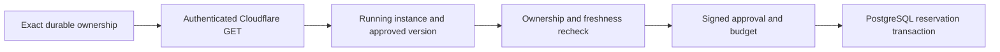

# Workflow deployment readback before admission

Issue [15](https://github.com/frankxai/starlight-swarm/issues/15), 4 October 2026.
The creator outcome is a Queen that sends useful work to replaceable cloud
executors, preserves the exact mission after interruption, and measures output,
repair effort and attributable cost. This change supplies one admission boundary;
it does not establish that creator outcome or enable a live worker.

## What is enforced

`CloudflareWorkflowOperationAdmission.admit()` requires its server-constructed
`CloudflareWorkflowObserver`. Registration and recovery still work without an
observer; admission refuses. Caller-authored receipts, callback transports and
objects with the observer prototype cannot substitute for its private transport
and issued-observation state. Bootstrap captures the actual observer methods.

The existing bounded authenticated GET transport verifies the account/workflow
UUID, name, exact instance, Workflow version and digest-only operation envelope.
The admission front door accepts only a fresh issued observation whose instance
is running and whose script is explicitly not deleted. Queued, paused, waiting,
rollback and terminal states refuse a new reservation. Missing script-deletion
metadata remains unknown and refuses; this conservative requirement needs real
tenant compatibility verification before a pilot.

Durable exact ownership must be ready both before and after the network read.
The current clock and observation freshness are checked again afterwards. The
reservation lifetime is capped by the earlier bootstrap/observation expiry,
leaving at least one second. The existing signed human approval, signed budget,
revocation, capacity, prepared state, capabilities, cumulative windows and
duplicate-effect checks still execute through the PostgreSQL authority lock.
Denials use the existing durable audit path. Storage failure cannot grant admission.

## Why readback is required

Cloudflare's current [REST create contract](https://developers.cloudflare.com/api/resources/workflows/subresources/instances/methods/create/)
starts execution and returns its version afterwards. It exposes no version
selector. The [Workers API](https://developers.cloudflare.com/workflows/build/workers-api/)
provides the event's actual instance ID and workflow name.
[Worker version metadata](https://developers.cloudflare.com/workers/runtime-apis/bindings/version-metadata/)
describes a Worker version; no equivalence with a Workflow version is assumed here.
The earlier alternative of checking only a prepared JSON target would allow
reservation without reading the instance that actually started. Regression tests
reproduce that missing check and exercise authenticated wrong-version denial.

## Remaining execution boundaries

This is a control-plane snapshot before reservation. It is not an atomic proof of
Cloudflare state at a later effect, an authenticated caller/runner identity, or a
native `WorkflowEntrypoint` deployment. The generic `OperationAuthority` remains
a trusted server-internal primitive; it does not call the Cloudflare observer.
Do not expose it as an alternate workflow admission endpoint. The SQL schema and
role grants are unchanged; PostgreSQL has no new durable deployment-observation
predicate in this change. Successful readback is not newly stored as an audit event.

Trusted native entrypoint and executor enforcement before each relevant effect,
durable exact create intent, authenticated create/dispatch, uncertain-start
readback and external-effect reconciliation remain required. Workflows can retry
steps; follow Cloudflare's [idempotency guidance](https://developers.cloudflare.com/workflows/build/rules-of-workflows/)
and preserve exact IDs. HTTP 404 is inconclusive. A terminal workflow does not
prove runner descendants stopped, effects settled or budget commitments released.

Local transport tests use mocked DNS/TLS/HTTP and fault-injected SQL readbacks.
The existing CI exercises actual PostgreSQL 17, signed admission, competing
requests, cancellation, typecheck, build and non-live dry run. Neither test scope
proves a live tenant, accepted creator artifact or security-approved pilot.
Independent exact-source review and all named pilot gates remain necessary.
No purchase, paid fallback, recurring schedule, creation, deployment or production
activation is introduced. Policy loading remains distinct from deployed enforcement.
